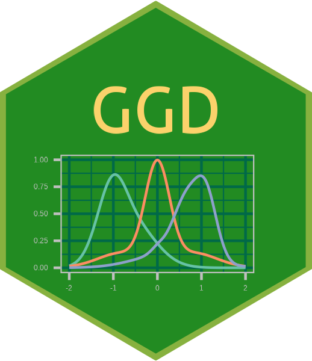
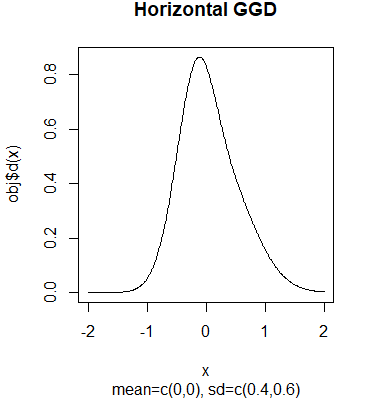
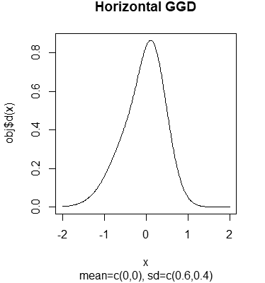
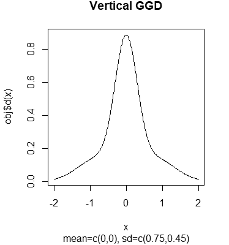
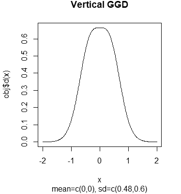
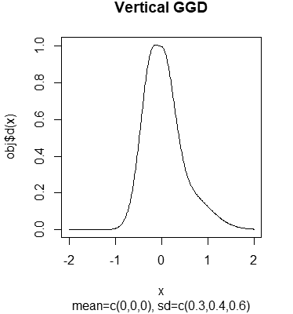
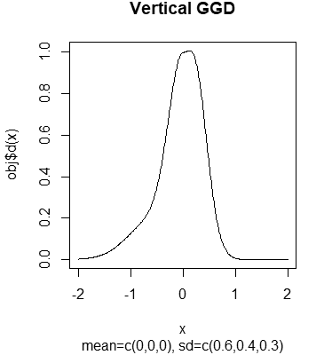
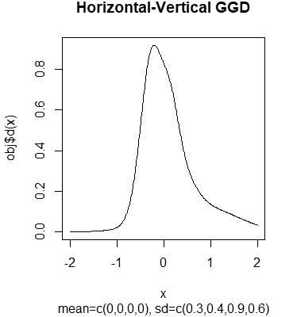
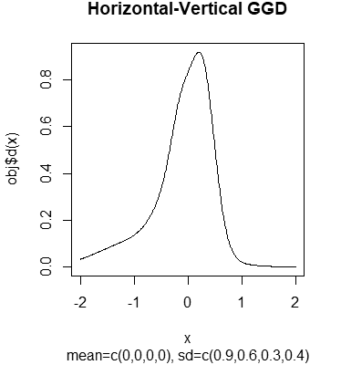

# GGD -  Gradational Gaussian Distribution 

Here is an R package of a reference class provides a Gradational Gaussian Distribution (GGD).
It can approximates asymmetric frequency distributions or traces quantiles accurately with GGD models.

[日本語](README.ja.md)

## What is the Gradational Gaussian Distribution?

The **Gradational Gaussian Distribution (GGD)** (Named by the author on his own)
is one of continuous distribution models
for mainly modeling asymmetric unimodal data which do not follow a normal distribution.
Without $\log$ transformations,
it can represent distributions which do not follow a normal distribution:
skewed, heavy-tailed, flat-topped etc.

The GGD is alike the **Gaussian mixture model (GMM)** but different.
The GMM is represented by linear combinations of some normal distributions,
and is often used for clustering of mixed data.
On the other hand, the GGD is a distribution of which mixes some normal distributions
with gradually changing ratio along the x-axis or y-axis directions,
and treat non-normal distribution data as it is.
Please remark that the GGD is not a convolution of normal distributions.

The GGD model may be applied as a distribution model of data
which is a bit like a normal distribution but never follows any normal distribution model
because some effects by (hidden) continuous parameters.

This package provides following GGD models:
+ Horizontal Gradational Distribution
+ Vertical Gradational Distribution (with 2 or 3 components)
+ Horizontal-Vertical Gradational Distribution

### Horizontal Gradational Distribution

A **horizontal gradational distribution** is a distribution model
in which the mixing ratio of two normal distributions varies gradually along the x-axis.
This model is suitable for representing left- or right-skewed distributions. 

We write a sign of a horizontal gradational distribution as
$\mathcal{G}[\mathcal{N}_1 \rightarrow \mathcal{N}_2]$. 
It means that as the x-coordinate increases from $-\infty$ to $\infty$,
the shape of the probability density function gradually changes
from that of a normal distribution $\mathcal{N}_1$ to that of $\mathcal{N}_2$.

Generally it is expressed as

$$
\mathcal{G}[\mathcal{N}_1 \rightarrow \mathcal{N}_2] =
    h_1(x) \ \mathcal{N}_1 + h_2(x) \ \mathcal{N}_2,
$$

where $h_1$ and $h_2$ are the mixing ratio functions defined
using $\Phi_1$ and $\Phi_2$, the cumulative distribution functions of
$\mathcal{N}_1$ and $\mathcal{N}_2$ as

$$
\begin{align}
h_1(x) &= 1 - \Phi_1(x), \\
h_2(x) &= \Phi_2(x).
\end{align}
$$

Therefore, $h_1(x)$ decreases gradually along x-axis as
$x:-\infty \to \infty \ \Rightarrow \ h_1(x):1 \to 0$,
and $h_2(x)$ increases gradually as
$x:-\infty \to \infty \ \Rightarrow \ h_2(x):0 \to 1$.
Normalizer $1 - \Phi_1(x) + \Phi_2(x)$ to make $\forall x, \ h_1 + h_2 = 1$ is not used
in order to simplify the expression and make integral easier.
Unlike GMM, normalization is not required for GGD
to satisfy the conditions as a probability distribution.

Here, $\mathcal{N}_1$ is dominant on the left (lower) side of x-axis,
and $\mathcal{N}_2$ is on the right (upper) side.
So we call $\mathcal{N}_1$ the **left- (lower-) side distribution**,
and $\mathcal{N}_2$ the **right- (upper-) side distribution**.

### Vertical Gradational Distribution (2 components)

A **(2-component) vertical gradational distribution** is a distribution model
in which the mixing ratio of two normal distributions varies gradually along the y-axis.
This model is suitable for representing heavy-tailed or flat-topped or very sharp distributions. 

We write a sign of a vertical gradational distribution as
$\mathcal{G}[\mathcal{N}_1 \uparrow \mathcal{N}_2]$. 
It means that, at least as an image, as the y-coordinate increases from $0$ to $1$,
the shape of the probability density function gradually changes
from that of a normal distribution $\mathcal{N}_1$ to that of $\mathcal{N}_2$.

Here, we call $\mathcal{N}_1$ the **tail-side distribution**,
and $\mathcal{N}_2$ the **top-side distribution**.

Generally it is expressed as

$$
\mathcal{G}[\mathcal{N}_1 \uparrow \mathcal{N}_2] =
    v_1(x) \ \mathcal{N}_1 + v_2(x) \ \mathcal{N}_2,
$$

where the mixing ratio functions $v_1$ and $v_2$ are defined
using $f_1$ and $f_2$, the probability density functions of
$\mathcal{N}_1$ and $\mathcal{N}_2$ as

$$
\begin{align}
v_1(x) &= 1 - \dfrac{f_1(x)}{f_1(\mu_1)}, \\
v_2(x) &= \dfrac{f_2(x)}{f_2(\mu_2)},
\end{align}
$$

where $\mu_1$ and $\mu_2$ are the mean values of $\mathcal{N}_1$ and $\mathcal{N}_2$, respectively.

Here, $v_1(x)$ is decreasing gradually along y-axis,
i.e. value of $f_1(x)$ as

$$
f_1(x):0 \to \max_{x \in (-\infty, \infty)}f_1(x)
    \ \Rightarrow \ v_1(x):1 \to 0,
$$

and inversely, $v_2$ is increasing gradually as

$$
f_2(x):0 \to \max_{x \in (-\infty, \infty)}f_2(x)
    \ \Rightarrow \ v_2(x):0 \to 1.
$$

Or, we can write as

$$
\begin{align}
x:-\infty \to \mu_1 \ \Rightarrow \ v_1(x):1 \to 0, \ \ \ \
x:\mu_1 \to \infty \ \Rightarrow \ v_1(x):0 \to 1, \\
x:-\infty \to \mu_2 \ \Rightarrow \ v_2(x):0 \to 1, \ \ \ \
x:\mu_2 \to \infty \ \Rightarrow \ v_2(x):1 \to 0.
\end{align}
$$

Normalizer $1 - f_1(x)/f_1(\mu_1) + f_2(x)/f_2(\mu_2)$ to make $\forall x, \ v_1 + v_2 = 1$
is not used as in the horizontal case.

Normally, the shape of the probability density function of
$\mathcal{G}[\mathcal{N}_1 \uparrow \mathcal{N}_2]$ should be gradually
change from the shape of $f_1$ to $f_2$ along y-axis,
and the top of it should be same as or nearby the top of $f_2$.

However, note that $\mu_1$ and $\mu_2$ are not necessarily equal to each other.
Therefore, depending on how $\mathcal{N}_1$ and $\mathcal{N}_2$ are taken,
The tops of $f_1$ and $f_2$ could be far apart from each other,
and moreover, the top of $\mathcal{G}[\mathcal{N}_1 \uparrow \mathcal{N}_2]$ could be
nearby the top of $f_1$, instead of $f_2$.
That may be contrary to the intuitive image of the "vertical gradational distribution",
but it is not prohibited.

This is why I wrote "at least as an image" earlier for about
the shape changing of the probability density function of $\mathcal{G}[\mathcal{N}_1 \uparrow \mathcal{N}_2]$.

### Vertical Gradational Distribution (3 components)

You can divide the tail-side distribution along x-axis into left (lower) side
and right (upper) side.

In other words, we can consider a skewed distribution model in which the probability density function
gradually varies from that of $\mathcal{N}_1$ to $\mathcal{N}_2$ as the x-coordinate moves
from the left-side-tail ($x:-\infty \to \mu$) to the top of the distribution,
and then again from the top to the right-side-tail ($x:\mu \to \infty$),
this time the probability density function varies to that of $\mathcal{N}_3$,
which is different from $\mathcal{N}_1$.

In this case, we write a sign of the distribution as
$\mathcal{G}[\mathcal{N}_1 \uparrow \mathcal{N}_2 \downarrow \mathcal{N}_3]$.
Generally it is defined as

$$
\mathcal{G}[\mathcal{N}_1 \uparrow \mathcal{N}_2 \downarrow \mathcal{N}_3] =
    v_1(x) \ \mathcal{N}_1 + v_2(x) \ \mathcal{N}_2 + v_3(x) \ \mathcal{N}_3,
$$

where the mixing ratio function $v_1$ is defined as

$$
v_1(x) =
\begin{cases}
    1 - \dfrac{f_1(x)}{f_1(\mu_1)} & (x \leq \mu_1), \\
    0 & (x > \mu_1),
\end{cases}
$$

$v_3$ is defined as

$$
v_3(x) =
\begin{cases}
    0 & (x < \mu_3), \\
    1 - \dfrac{f_3(x)}{f_3(\mu_3)} & (x \geq \mu_3),
\end{cases}
$$

and $v_2(x)$ for the top side is defined as same as with 2 components.

Here, we call $\mathcal{N}_1$ the **left- (lower-) tail-side distribution**,
and $\mathcal{N}_3$ the **right- (upper-) tail-side distribution**,
regardless whether each of mean values, $\mu_1$ and $\mu_3$ is greater.

### Horizontal-Vertical Gradational Distribution

Two vertical GGDs $\mathcal{G}_1$ and $\mathcal{G}_2$ can mixture
as same as normal distributions $\mathcal{N}_1$ and $\mathcal{N}_2$ for the horizontal GGD.

In this case, we write a sign of the distribution as
$\mathcal{G}[\mathcal{G}_1 \rightarrow \mathcal{G}_2]$.
Generally it is defined as

$$
\mathcal{G}[\mathcal{G}_1 \rightarrow \mathcal{G}_2] =
    h_1(x) \ \mathcal{G}_1 + h_2(x) \ \mathcal{G}_2
$$

where $h_1(x)$ and $h_2(x)$ are as same as those for the horizontal gradational distribution.
And then
(sorry, I write here $G$ and $N$ instead of $\mathcal{G}$ and $\mathcal{N}$,
 because the engine of GitHub seems not to interpret double subscripts well with them),

$$
G_1 = G[N_{1,1} \uparrow N_{1,2}]
  = v_{1,1}(x) \ N_{1,1} + v_{1,2}(x) \ N_{1,2},
$$

$$
G_2 =
    G[N_{2,1} \uparrow N_{2,2}] =
    v_{2,1}(x) \ N_{2,1} + v_{2,2}(x) \ N_{2,2}
$$

where each $N_{i,j}$ is a normal distribution
and $v_{i,1}(x)$ and $v_{i,2}(x)$ are as same as $v_1(x)$ and $v_2(x)$ for the vertical gradational distribution.

This model is suitable for, for example, representing skewed and heavy-tailed distributions. 

## Package overview

This package can generate objects for the following kinds of distribution models:

0. Normal Distribution
1. Mean of 2 Normal Distributions (a kind of Gaussian mixture model)
2. Horizontal Gradational Distribution
3. Vertical Gradational Distribution (2 or 3 components)
4. Horizontal-Vertical Gradational Distribution

The 0 and 1 of above are not kinds of GGD.
They can be used as criteria to determine if it is appropriate to use GGD as a distribution model for the data.

Each of 1 to 4 of above can be further classified
according to the conditions of the normal distribution of the components as follows:

+ Mean-Differed Sigma-Equaled: a distribution with components of different means and equal standard deviations
+ Mean-Equaled Sigma-Differed: a distribution with components of equal means and different standard deviations
+ Mean-Differed Sigma-Differed: a distribution with components of both means and standard deviations are different

Therefore, there are a total of 16 kinds of distribution models.

The larger the number of the kind,
the more degrees of freedom and the more complex distribution can be represented.
But simple models may be easier to use for analyzing data.

## Major functions and members

| Type      | Name                  | Overview                                                  |
| :-------: | :-------------------: | :-------------------------------------------------------- |
| Generator | ggd.nls.freq          | Generates a GGD object that approximates a frequency distribution. |
| 〃        | ggd.nls.freq.all      | Approximates a frequency distribution with all supported distribution models. |
| 〃        | ggd.trace.q           | Generates a GGD object that traces quantiles.             |
| 〃        | ggd.set.cmp           | Generates a GGD object with indicated components.         |
| Field     | median                | The median value  of the distribution.                    |
| 〃        | mean                  | The mean value of the distribution.                       |
| 〃        | sd, usd, lsd          | The standard deviation, upper semi-standard deviation and lower semi-standard deviation. |
| Method    | d                     | Returns the values of the probability density function.   |
| 〃        | p                     | Returns the values of the cumulative probability function.    |
| 〃        | q                     | Returns the values of the quantile function.              |
| 〃        | r                     | Returns random samples following the distribution.        |
| 〃        | tex                   | Displays the formulas of the probability density function and the cumulative distribution function in TeX format. |
| 〃        | read.csv              | Read the composition of a GGD object from a CSV file.     |
| 〃        | write.csv             | Write the composition of a GGD object to a CSV file.      |

The mean and standard deviation are calculated using the dnorm and pnorm functions in 'stats' package and four arithmetic operations
(semi-standard deviations of the horizontal-vertical gradational distribution are computed with numerical integration).
Therefore, the accuracy of the them depends on the dnorm and pnorm functions.

## Installation

<pre>
# Install devtools from CRAN
install.packages( "devtools" )

# Then use devtools::install_github( "user/repository" ) to install cgd package from GitHub
devtools::install_github( "Kimitsuna-Goblin/ggd" )
</pre>

## Details of supported distribution models

### 0. Normal Distribution

#### Distribution function and cumulative distribution function

The probability density function $f(x)$ and cumulative distribution function $\Phi(x)$ are expressed as follows.

$$
\begin{align}
f(x) &= \dfrac{1}{\sqrt{2 \pi \sigma^2}} \exp \left( -\dfrac{(x - \mu)^2}{2 \sigma^2} \right)\\
\Phi(x) &= \dfrac{1}{\sqrt{2 \pi \sigma^2}} \int_{-\infty}^{x} \exp \left( -\dfrac{(t - \mu)^2}{2 \sigma^2} \right) dt
\end{align}
$$

#### Description

This is the so-called normal distribution.
This is provided to compare the adequacy of data modeling between a normal distribution and GGD models.
Also, it can trace 2 quantiles (e.g., tertiles) with the cumulative density function.

### 1. Mean of 2 Normal Distributions

#### Distribution function and cumulative distribution function

The probability density function $g(x)$ and cumulative distribution function $\Psi(x)$ are
expressed as follows using the 2 normal distributed probability density functions $f_1(x)$ and $f_2(x)$
and cumulative distribution functions $\Phi_1(x)$ and $\Phi_2(x)$.

$$
\begin{align}
g(x) &= \dfrac{1}{2} ( f_1(x) + f_2(x) )\\
\Psi(x) &= \dfrac{1}{2} ( \Phi_1(x) + \Phi_2(x) )
\end{align}
$$

#### Description

This is a kind of the Gaussian mixture model (GMM).
It is provided to compare the adequacy of data modeling with GMM and GGD.
Also, it can trace 3 or 4 quantiles with the cumulative density function.

### 2. Horizontal Gradational Distribution

#### Distribution function and cumulative distribution function

The probability density function $g(x)$ and cumulative distribution function $\Psi(x)$ are
expressed as follows using the 2 normal distributed probability density functions $f_1(x)$ and $f_2(x)$
and cumulative distribution functions $\Phi_1(x)$ and $\Phi_2(x)$.

$$
\begin{align}
g(x) &= \left( 1 - \Phi_1(x) \right) f_1(x) + \Phi_2(x) f_2(x)\\
\Psi(x) &= \Phi_1(x) - \dfrac{1}{2} \Phi_1(x)^2 + \dfrac{1}{2} \Phi_2(x)^2
\end{align}
$$

#### Description

The horizontal gradational distribution model
can trace left- or right-skewed 3 or 4 quantiles with the cumulative density function.

Sample images of probability density functions are:

 

### 3. Vertical Gradational Distribution

#### Distribution function and cumulative distribution function

The probability density function $g(x)$ and cumulative distribution function $\Psi(x)$
are expressed as follows using 2 or 3 normally distributed probability density functions $f_i(x)$
and cumulative distribution function $\Phi_i(x)$ $(i = 1, 2, 3)$.

In the following expressions,
$\Phi^\ast_i(x)$ represents the cumulative distribution function of the normal distribution
with mean $\mu_i$ and standard deviation $\sigma_i / \sqrt{2}$.

3-1. Vertical gradation with 2 components

$$
\begin{align}
g(x) &= \left( 1 - \dfrac{f_1(x)}{f_1(\mu_1)} \right) f_1(x) + \dfrac{f_2(x)}{f_2(\mu_2)} f_2(x)\\
\Psi(x) &= \Phi_1(x) - \dfrac{1}{\sqrt{2}} \Phi^\ast_1(x) + \dfrac{1}{\sqrt{2}} \Phi^\ast_2(x)
\end{align}
$$

3-2. Vertical gradation with 3 components

$$
\begin{align}
g(x) &= g_1(x) + g_2(x) + g_3(x) \\
\Psi(x) &= \Psi_1(x) + \Psi_2(x) + \Psi_3(x)\\
\\
g_1(x) &= \left\lbrace
\begin{array}{l}
\left( 1 - \dfrac{f_1(x)}{f_1(\mu_1)} \right) f_1(x) & (x \leq \mu_1)\\
0 & (x > \mu_1)\\
\end{array} \right.\\
g_2(x) &= \dfrac{f_2(x)}{f_2(\mu_2)} f_2(x)\\
g_3(x) &= \left\lbrace
\begin{array}{l}
0 & (x < \mu_3)\\
\left( 1 - \dfrac{f_3(x)}{f_3(\mu_3)} \right) f_3(x) & (x \geq \mu_3)
\end{array} \right.\\
\\
\Psi_1(x) &= \min \left( \Phi_1(x) - \dfrac{1}{\sqrt{2}} \Phi^\ast_1(x), \ \dfrac{2 - \sqrt{2}}{4} \right)\\
\Psi_2(x) &= \dfrac{1}{\sqrt{2}} \Phi^\ast_2(x)\\
\Psi_3(x) &= \max \left( 0, \ \Phi_3(x) - \dfrac{1}{\sqrt{2}} \Phi^\ast_3(x) - \dfrac{2 - \sqrt{2}}{4} \right)
\end{align}
$$

#### Description

The vertical gradational distribution is a model that emphasizes the kurtosis of the distribution.
It can trace from 3 to 6 quantile points with the cumulative distribution function,
but is not suitable for tracing equally spaced few number quantiles such as $p = 0.25, 0.5, 0.75$.
When tracing a quantile, choose representative quantiles for the tails and the top,
for example $p = 0.1, 0.4, 0.6, 0.9$.
For symmetrical distributions, it is also useful to choose quantiles biased to one side,
for example $p = 0.1, 0.4, 0.5$. 

Sample images of probability density functions are:

+ 2-component models

 

+ 3-component models

 

### 4. Horizontal-Vertical Gradational Distribution

#### Distribution function and cumulative distribution function

The probability density function $g(x)$ and cumulative distribution function $\Psi(x)$
are expressed as follows using the probability density function $f_{i,j}(x)$
and cumulative distribution function $\Phi_{i,j}(x)$ $(i, j = 1, 2)$ for 4 normal distributions.

In the following expressions,
$\Phi^\ast_{i,j}(x)$ represents the cumulative distribution function of the normal distribution
with mean $\mu_{i,j}$ and standard deviation $\sigma_{i,j} / \sqrt{2}$.

$$
\begin{align}
g(x) &= \left( 1 - \Psi_1(x) \right) g_1(x) + \Psi_2(x) g_2(x)\\
\Psi(x) &= \Psi_1(x) - \dfrac{1}{2} \Psi_1(x)^2 + \dfrac{1}{2} \Psi_2(x)^2\\
\\
g_i(x) &= \left( 1 - \dfrac{f_{i,1}(x)}{f_{i,1}(\mu_{i,1})} \right) f_{i,1}(x) + \dfrac{f_{i,2}(x)}{f_{i,2}(\mu_{i,2})} f_{i,2}(x)\\
\Psi_i(x) &= \Phi_{i,1}(x) - \dfrac{1}{\sqrt{2}} \Phi^\ast_{i,1}(x) + \dfrac{1}{\sqrt{2}} \Phi^\ast_{i,2}(x)
\end{align}
$$

#### Description

The horizontal-vertical gradational distribution has the most degrees of freedom in this package
and can represent the most complex distributions.
This model can trace 5 to 8 quantiles with the cumulative density function.
For example, quantiles of $p = 0.1, 0.25, 0.4, 0.5, 0.6, 0.75, 0.9$ can be traced.  

More than 8 quantiles cannot be traced with any models in this package.
If you have more than 8 quantiles, make a frequency distribution and try ggd.nls.freq instead.

Sample images of probability density functions are:

 

## Postscript

The GGD model was invented by the author of this package,
but I think that someone had come up with the GGD already and there may be some prior researches.
If you have any research information about this model, please let me know.

